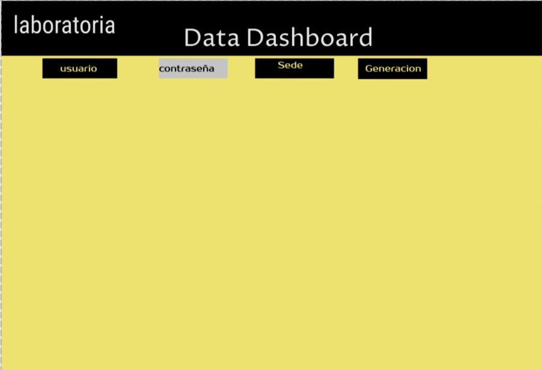
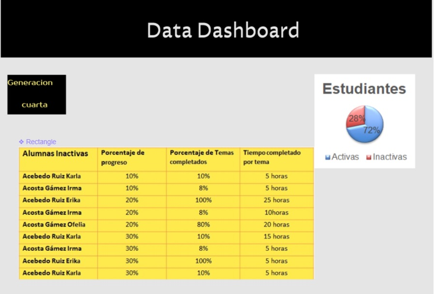
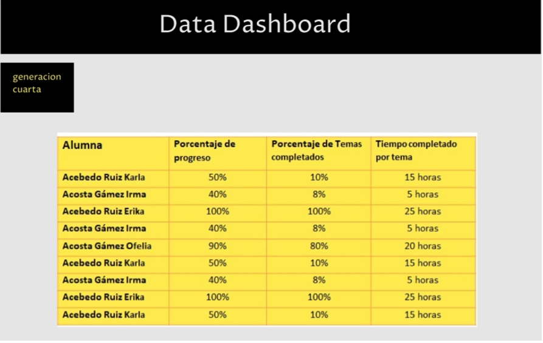
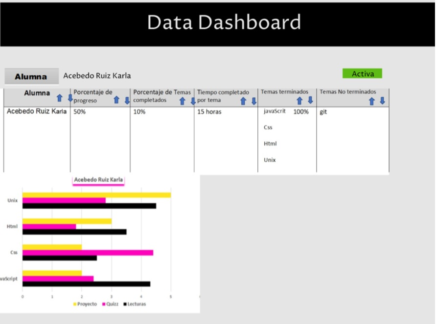

# **Data Dashboard**

## **Proceso de UX**

Nuestro primer acercamiento lo haremos a través del proceso de diseño, donde pasamos por diferentes etapas como:

### **1. Descubrimiento e investigación**
(En esta fase es donde vamos a tener ese proceso de investigación y acercamiento con el usuario, es donde vamos a obtener el conocimiento para poder saber a quién vamos a llegar, pero de manera más profunda. Es tener la empatía y el acercamiento necesario para conocerlo.

También vamos a tener en cuenta al negocio, sus objetivos y a los stakeholders(involucrados)).

__Usuarixs:__  (Toda la información que sepas de ellxs, ya sea porque las has podido observar o porque obtuviste datos directamente de ellas)

__Necesidades de las usuarias:__

__Objetivos de las usuarias:__ (Lo que quieren o esperan lograr)

__Pain points:__ (En sus actividades diarias qué es lo que más les molesta u obstaculiza en el proceso de  realizar sus actividades/objetivos)

__Sentimientos:__(Sentimientos que les surgen dentro del proceso de sus actividades. Identificar cuáles predominan)

__Técnicas usadas en esta fase:__ (Sabemos que en este punto, tal vez, sólo has ocupado encuestas, no te olvides de documentar este proceso de recolección de datos)

__5. Objetivos del negocio:__ (Enlistarlo(s))

__6. Motivaciones del negocio para el data dashboard:__(Enlistarlo(s))

### **2. Síntesis y definición**
(Dada la fase anterior de investigación, ahora vamos a tomar todos los datos más importantes y transformarlos en información valiosa para comenzar a orientarse a la solución. También vamos a entender lo que la empresa quiere de ese producto y comenzar a entender ambas visiones con el fin de encontrar un punto armónico)

__1. Cuáles crees que son los datos más importantes a tener en cuenta para el Data Dashboard:__

   - Sobre las estudiantes:
 

__2. Lo que los usuarios esperan obtener:__

__3. Insights:__

__4. Data proporcionada:__ 

     -_Data relacionada a los cursos:_

__5. Insights del negocio:__

### **3. Ideación**
(Acá se comienza a pensar esa solución tomando en cuenta la información recopilada y procesada)

### **4. Prototipado**
(Esta es la fase creativa, donde se comienza a construir el Data dashboard con la información obtenida de las fases anteriores. Se reafirma crear la experiencia de usuario, donde la solución resuelve necesidades y facilita la vida)

Sketch: (Adjuntar liga)

Prototipo en figma: (Adjuntar liga)

### **5. User testing**
(Si deseas validar tu propuesta, acércate a tu usuario y que te de feedback con el fin de mejorar tu producto en beneficio del negocio y de tu usuarix).
****

# Argumentacion de Diseño

 El objetivo del *Data Dashboard* es crear un producto cuya funcionalidad sea tener al día los avances de las estudiantes a través de una interfaz que sea sencilla, intuitiva y fácil de usar. Este producto está pensado en las Training Manager para que su trabajo sea más eficiente ya que eras tienen la necesidad de revisar los avances y el progreso general y particular de las estudiantes de su propia sede y de las otras sedes.

 Gracias a este producto se mostrará el avance del uso de la plataforma de aprendizaje LMS (Learning Managment System), también se encontrará información más específica del promedio de cada unidad y por subtema, así como también es importante mostrar el avance individual y detallado de cada estudiante.

El Proponer un *Login* es para que las ***Training Manager***  tengan más confidencialidad, ya que ellas tienen información confidencial de todas las estudiantes. Las gráficas que se muestran fueron pensadas en su fácil lectura, ya que por su estructura se ven los datos de forma visual mucho más rápido ya que se requiere poder ver datos muy generales y a la vez también poder acceder a datos específicos.

Todo esto se hace pensando en que su consulta será constante es por eso que tiene que ser una plataforma amigable y bastante intuitiva, los colores que utilizamos son los d Labratoria esto para seguir con la marca identificativa de laboratorio, Se muestra la propuesta gráfica del prototipo de Alta Fidelidad, se realizó en la plataforma *** FIGMA.***

